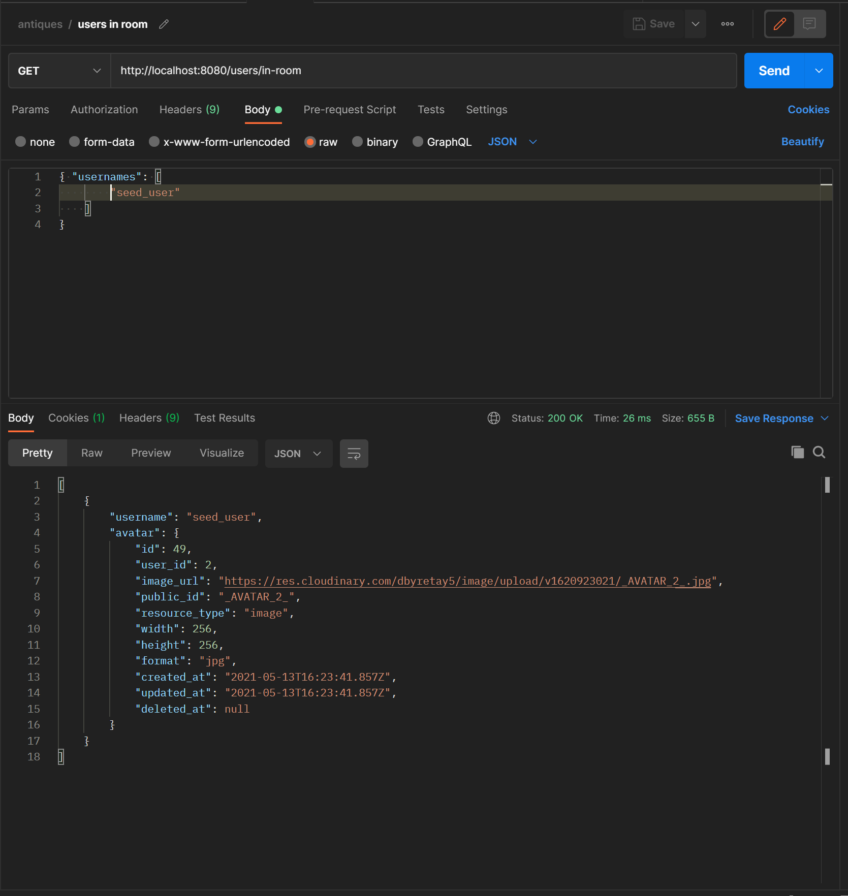

# `ANTIQUE SOCIAL MEDIA`

#### Created By David Couch
##### `Project Started 4 / 11 / 2021`
### This project is two previous projects combined

# `front-end`

  This Project is a Work in Progress

  The current concept is chat rooms that are tied to a users antique

  #### Current Features

  - Framer Motion Slideshow and screen transitions
  - conditional user online with animation
  - Socket servers for
    - User online status
    - Chat messages / rooms
  - Page for Global chat rooms
  - Images grid size is assigned on image load for dynamic grids with respect to the original aspect ratio
  - Page for users to see how many people are talking in their chat rooms
  - Endless scroll loading intersection observer (new pictures load as the user scrolls)
  - Users can upload many images to their post and have a smooth slideshow to show them off
  - Users can change the image grid size with a slider option
  - Likes page
  - Posts page
  - User Collections Page
  - Picture upload through cloudinary
  - HTTP Only session call on startup through Context

# `Tech Used`
- axios
- socket io - client `4.0.1`
- framer-motion `4.1.9`
- react-router-dom `5.2.0`
- styled-components `5.2.3`
- render-smooth-image-react `1.0.3`
- emojis-list `3.0.0`
- rc-slider `9.7.2`
## `Dev Depends`
- faker `5.5.3`
- babel-eslint `10.1.0`


# `PREVIEW`


# `Backend`

  This Project is an Work in Progress, This was mad for the love of javascript and exploration in a full stack javascript social media app.

  This is API application made with Node.js that currently features,

    - HTTP only json web token authentication
    - bcrypt password hashing
    - cloudinary image upload routes ( cloud images merged through async array mapping )
    - socket.io for online status and chat rooms
    - async + state functions to handle integration with socket.io and database queries for user online

  File Structure philosophy:

    Routes        :This file decides the routes and chosen controller
    Controller    :This file grabs the request and decides how to distribute it
    Serializer    :This file is used to combine logic from other files at the end of the chain and combine pictures from cloud
    service       :This file parses through queries and altering incoming data with limited importing
    DAO           :This file strictly interacts with the databases its named by
    Model         :This file holds relationship data through the objection package

  This is an evolving project focused on efficiently and effectively take advantage of the technologies node.js give to developers. This Back end will be paired with a front end currently being developed to provide a fast and user friendly experience.


# `Tech Used`
  * `bcrypt`
  * `express`
  * `express-jwt`
  * `jsonwebtoken`
  * `knex`
  * `moment`
  * `objection`
  * `socket.io`
  * `multer-storage-cloudinary`
  * `yup`
  * `pg`
  * `cloudinary`
  * `cookie-parser`
  * `cors`
  * `dotenv`
## `Dev Depends`
  * `eslint`
  * `faker`
  * `jest`
  * `jest-environment-node`
  * `supertest`
  * `uuid`

### `Route examples`

(currently under construction, some calls might not be exact)

## `SESSIONS`


## `ANTIQUES`


## `AVATAR`


## `IMAGES`


## `LIKES`


## `USER OBJECT SHAPE ( for demo )`


## `USERS`


#### `ITERATIVE ROUTE FOR ROOM USERS PROVIDED IN ARRAY`



### `Install`
requirements for install ( git - code editor )
- Go To ( https://github.com/dcouch440/antique_social_media )
- Click on the Green Code button
- Copy the code and clone the project
```
git clone https://github.com/dcouch440/antique_social_media.git
```
- then change directories to open the project
```
cd antique_social_media
```
- from here if you have vs code installed type
```
code .
```
- from here you can now view the project